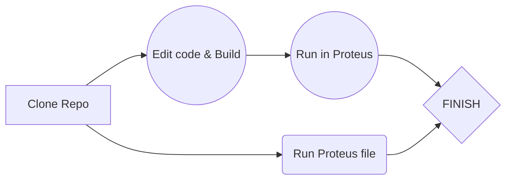

**Written on**

**Works  with**
*Atmega32 & Atmega16, and all subversions of them.*
***
**Hint**
- **ex**: exercises from AVR projects file.
- **clsex**: exercises given in the class.

**File tree example**
|Atmel projects |Proteus files |HEX files |
|----------------|-----------------|------------------|
|`./atmlcod-pro/`|`./proteus-pro/'`|`'./avrhexs-pro/'`|

**How to use**
